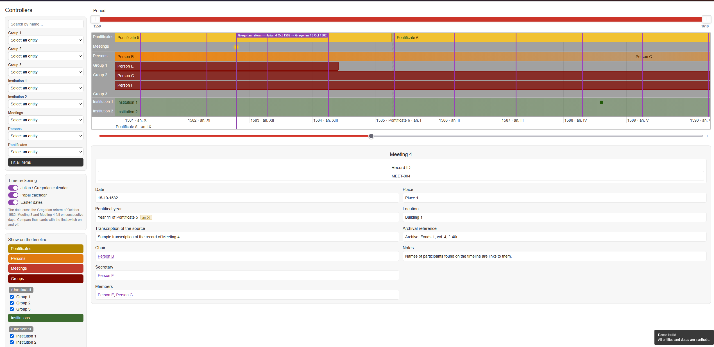
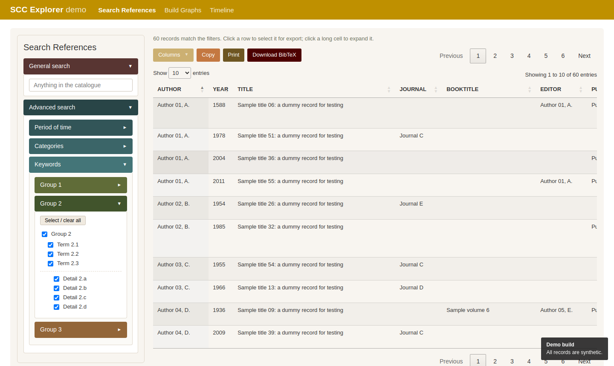
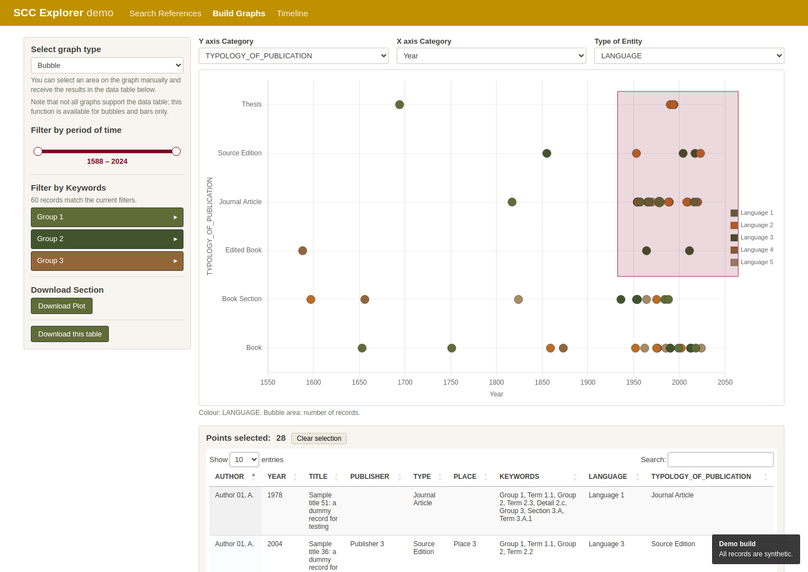

# SCC Explorer — applications

[](https://github.com/SCC-projects/scc-explorer/actions/workflows/ci.yml)
[](LICENSE)
[](docs/LICENSE)

Static, server-free versions of the research applications of the **SCC Explorer
platform**, built by the research group
[Governance of the Universal Church after the Council of Trent](https://www.lhlt.mpg.de/research-group/governance-of-the-universal-church-after-the-council-of-trent)
at the Max Planck Institute for Legal History and Legal Theory. 

> **This repository ships with synthetic data.** Every record — authors, titles,
> keywords, events, people, dates — is generated by
> [`tools/generate_dummy_data.py`](tools/generate_dummy_data.py) to exercise each
> feature of the applications. The research datasets are published on the
> platform itself and are not part of this repository.

**Live demo:** <https://scc-projects.github.io/scc-explorer/>



## The applications

| | |
|---|---|
| **[Search References](references/search.html)** | A bibliographic catalogue. General search across every field, a period slider, per-field selects (author, title, year, publisher, place, language) and a hierarchical keyword tree. Results export to BibTeX — the whole result or hand-picked rows. |
| **[Build Graphs](references/graph.html)** | The same catalogue as charts: bubble, bar and pie on any pair of columns, filtered by the same keyword tree and period. Drag a rectangle across a bubble or bar chart to list the records it covers; export the chart as PNG and the selection as CSV, Excel or BibTeX. |
| **[Timeline](timeline/index.html)** | Points, ranges and background periods on a zoomable timeline, grouped in rows. Dates before October 1582 can be read in the Julian or the proleptic Gregorian calendar; a papal calendar labels the axis with regnal years; Easter Sunday can be drawn for every year. Names inside a card link to the matching entity, and every selection has a shareable URL. |




## Quick start

There is nothing to install and nothing to build. Clone the repository and open
`index.html` in a browser — the applications run from `file://` as well as from any
web server.

```sh
git clone https://github.com/SCC-projects/scc-explorer.git
cd scc-explorer
python -m http.server 8000      # optional; then open http://localhost:8000
```

The pages load their libraries from jsDelivr, so the first visit needs a network
connection. See [docs/deployment.md](docs/deployment.md) for offline use.

## Repository layout

```
├── index.html                  landing page
├── assets/demo.css             page shell of the demo (header, footer)
├── references/
│   ├── search.html  .js  .css  Search References
│   ├── graph.html   .js  .css  Build Graphs
│   ├── keywords.js             keyword tree shared by both
│   └── data/
│       ├── references.csv      source of truth
│       └── references.js       generated — do not edit
├── timeline/
│   ├── index.html  app.js  timeline.css
│   ├── config.js               groups, rows, cards: everything dataset-specific
│   └── data/
│       ├── timeline.csv        source of truth
│       └── timeline.js         generated — do not edit
├── tools/
│   ├── generate_dummy_data.py  writes both CSV files
│   ├── build_references.py     CSV → references.js
│   └── build_timeline.py       CSV → timeline.js
└── docs/                       documentation
```

## Working with the data

The CSV files are the source of truth; the `.js` files next to them are generated.
After editing a CSV, rebuild:

```sh
python tools/build_references.py
python tools/build_timeline.py
```

To regenerate the synthetic data from scratch (deterministic — the output is
identical on every run):

```sh
python tools/generate_dummy_data.py
python tools/build_references.py && python tools/build_timeline.py
```

Python 3.8 or later, standard library only. Both build scripts accept `--check`,
which fails if the generated file is stale; CI runs it on every push.

To use the applications with your own data, see
[docs/customising.md](docs/customising.md).

## Documentation

| | |
|---|---|
| [Architecture](docs/architecture.md) | How the pieces fit together, and why there is no server |
| [Data model](docs/data-model.md) | CSV columns, keyword matching, timeline items |
| [References Explorer](docs/references-explorer.md) | Search References and Build Graphs in detail |
| [Timeline Explorer](docs/timeline-explorer.md) | Features and the `config.js` reference |
| [Calendars](docs/calendars.md) | Julian / Gregorian conversion, papal calendar, Easter computus |
| [Customising](docs/customising.md) | Your own data, vocabulary, groups and colours |
| [Deployment](docs/deployment.md) | GitHub Pages, other hosts, embedding in an existing site |

## Technology

Plain HTML, CSS and JavaScript — no framework, no bundler, no build step for the
code. Libraries are pinned to exact versions and loaded with
[Subresource Integrity](https://developer.mozilla.org/docs/Web/Security/Subresource_Integrity)
hashes:

| Library | Version | Used by |
|---|---|---|
| [jQuery](https://jquery.com/) | 3.7.1 | Search References, Build Graphs |
| [DataTables](https://datatables.net/) + Buttons | 1.13.8 / 2.4.2 | Search References, Build Graphs |
| [Select2](https://select2.org/) | 4.1.0-rc.0 | Search References |
| [noUiSlider](https://refreshless.com/nouislider/) | 15.7.1 | all three |
| [Chart.js](https://www.chartjs.org/) | 4.4.1 | Build Graphs |
| [vis-timeline](https://visjs.github.io/vis-timeline/) | 7.7.3 | Timeline |

## History

The applications were first written in R with Shiny, `DT`, `ggplot2` and `timevis`
and ran on a Shiny server. In April 2026 they were rewritten as static
JavaScript for speed and ease of hosting; the Timeline has since gained the
calendar layers. See [CHANGELOG.md](CHANGELOG.md).

## Contributing

Issues and pull requests are welcome — please read
[CONTRIBUTING.md](CONTRIBUTING.md) first. One rule matters above the others:
**pull requests must not contain research data from the SCC project**, only
synthetic records.

## Citation

If you use this software, please cite it as described in
[CITATION.cff](CITATION.cff) (GitHub shows a “Cite this repository” button).
To cite the research content of the platform, follow the citation guidance
published on the platform.

## Licence

- **Code** — everything except the documentation — is released under the
  [MIT licence](LICENSE).
- **Documentation** — the `docs/` folder and the Markdown files in the
  repository root — is released under
  [CC BY 4.0](docs/LICENSE).

The synthetic datasets are produced by the code and fall under the MIT licence
with it.
